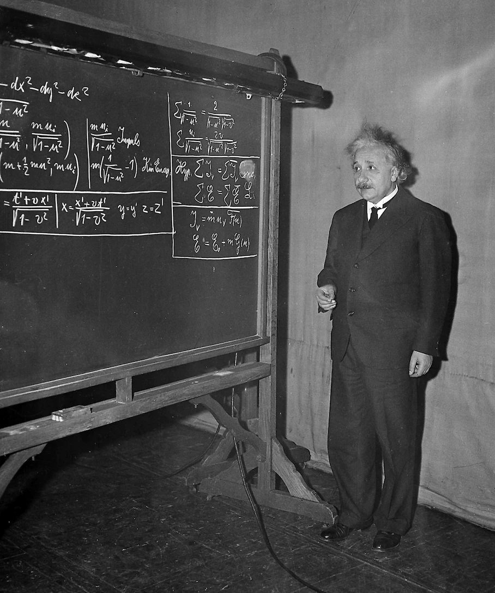

<H1 style="text-align: center;">Introducción a la Física Relativista</H1>

  
 

## Introducción

El año 1905 es conocido como el [*annus mīrābilis*](https://en.wikipedia.org/wiki/Annus_mirabilis_papers) de Albert Einstein.  Durante ese año, Einstein publicó cuatro artículos de investigación que, sin duda alguna, constituyen parte de los cimientos de la física moderna. Los dos más tardíos,

* Zur Elektrodynamik bewegter Körper, publicado el 26 de septiembre y  
* Ist die Trägheit eines Körpers von seinem Energieinhalt abhängig? de fecha 21 de noviembre.

Revolucionaron totalmente los conceptos de espacio, tiempo, masa y energía que semanejaban hasta aquel año. Y sentaron las bases de la Relatividad Especial que es junto con la mecánica cuántica es un paradigma fundamental de la física.

## Bibliografía

### General

* Walter Isaacson, [Einstein: His Life and Universe](https://books.google.com.co/books/about/Einstein.html?id=d2WZDgAAQBAJ&redir_esc=y)
* Abraham Pais, [Subtle is the Lord: The Science and the Life of Albert Einstein](https://books.google.com.co/books?id=0QYTDAAAQBAJ&printsec=frontcover&dq=pais+subtle+is+the+lord&hl=en&sa=X&redir_esc=y#v=onepage&q=pais%20subtle%20is%20the%20lord&f=false)
* L.D. Landau and G.B. Rumer, *What is Relativity?*

### Técnica

* Introductoria

  * Edwin F. Taylor, John Archibald Wheeler, [Spacetime Physics](https://books.google.com.co/books?id=PDA8YcvMc_QC&dq=taylor+wheerle+relativity&hl=en&sa=X&redir_esc=y)
  * N. M. J. Woodhouse, [Special Relativity](https://books.google.com.co/books?id=LH4pBAAAQBAJ&printsec=frontcover&dq=woodhouse+special+relativity&hl=en&sa=X&redir_esc=y#v=onepage&q=woodhouse%20special%20relativity&f=false)
  * Ray D´Inverno, [Introducing Einteinś Relativity: A Deeper Understanding](https://books.google.com.co/books?id=oCtzzgEACAAJ&dq=ray+d%C3%ADnverno+relativity&hl=en&sa=X&ved=2ahUKEwjWn9at9Nj6AhXZTjABHSwjB1QQ6AF6BAgMEAI)
  * Bernanrd Shcutz, [A First Course in General Relativity](https://books.google.com.co/books?id=V1CGLi58W7wC&printsec=frontcover&dq=schutz+relativity&hl=en&sa=X&redir_esc=y#v=onepage&q=schutz%20relativity&f=false)

* Avanzada

  * Jackson, [Classical Electrodynamics](https://books.google.com.co/books?id=6VV-EAAAQBAJ&printsec=frontcover&dq=j+d+jackson+classical+electrodynamics&hl=en&sa=X&redir_esc=y#v=onepage&q=j%20d%20jackson%20classical%20electrodynamics&f=false)
  * L.Landau E. M. Lifshitz, [The Classical Theory of Fields. Course of Theoretical Physics. Vol 4](https://books.google.com.co/books?id=X18PF4oKyrUC&printsec=frontcover&dq=landau+lifschitz+the+classical+theory+of+fields&hl=en&sa=X&redir_esc=y#v=onepage&q=landau%20lifschitz%20the%20classical%20theory%20of%20fields&f=false)
  * S. Weinberg, [Gravitation and Cosmology: Principles and Applications of the General Theory of Relativity](https://books.google.com.co/books?id=-QH2PgAACAAJ&dq=weinberg+relativity&hl=en&sa=X&redir_esc=y)
  * Misner Thorne Wheeler, [Gravitation](https://books.google.com.co/books?id=SyQzDwAAQBAJ&printsec=frontcover&dq=misner+thoren+wheeler&hl=en&sa=X&ved=2ahUKEwjpiL24-Nj6AhUvTTABHcDlCaAQ6AF6BAgMEAI#v=onepage&q&f=false)

  
    
## Cuadernos jupyter disponibles.

En Construcción 
 

## Lecturas

* Semana 1: Capítulos 1 y 2 de los [Apuntes del Curso (Versión Preliminar en Inglés)](lectures/Relativity_I.pdf)

* Semana 2: Capítulos 3 y 4 de los [Apuntes del Curso (Versión Preliminar en Inglés)](lectures/Relativity_I.pdf)

* Semana 3: **Consecuencias simples de la Relatividad Especial**, capítulo 5 de los [Apuntes del Curso (Versión Preliminar en Inglés)](lectures/Relativity_I.pdf)

* Semana 4: **Cuadrivelocidad y Cuadriaceleración**.  Capítulos 6 y 7 de los [Apuntes del Curso (Versión Preliminar en Inglés)](lectures/Relativity_I.pdf)

* Semana 5: **Partículas Cargadas en Campos Electromagnéticos I**.  Capítulo 8 de los [Apuntes del Curso (Versión Preliminar en Inglés)](lectures/Relativity_I.pdf)

* Semana 6: **Acción de la Partícula Libre**.  Capítulos 9 de los [Apuntes del Curso (Versión Preliminar en Inglés)](lectures/Relativity_I.pdf)

* Semana 7: **Corrección Relativista al Problema de Kepler**.  Capítulo 10 de los [Apuntes del Curso (Versión Preliminar en Inglés)](lectures/Relativity_I.pdf)
  
* Semana 8: **Partículas Cargadas en Campos Electromagnéticos II**, **Fotones**.  Capítulos 11 y 12 de los [Apuntes del Curso (Versión Preliminar en Inglés)](lectures/Relativity_I.pdf)

* Semana 9: **Formulación Covariante de la Electrodinámica I**.  Capítulo  13 de los [Apuntes del Curso (Versión Preliminar en Inglés)](lectures/Relativity_I.pdf)

* Semana 10: **Formulación Covariante de la Electrodinámica II**.  Capítulo  13 de los [Apuntes del Curso (Versión Preliminar en Inglés)](lectures/Relativity_I.pdf)

* Semana 11: **Campos Producidos por una Carga Movil**. Capítulo  13 de los [Apuntes del Curso (Versión Preliminar en Inglés)](lectures/Relativity_I.pdf)

## [Tareas](Tareas/Tareas.md)

  
## [Otros Recursos](Recursos/Resources.md).

