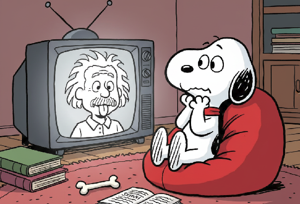

  

### Divulgación Científica e Interés General

1. Walter Isaacson, **Einstein: His Life and Universe**. Una biografía completa que sitúa el desarrollo de la relatividad en el contexto de la vida y la época de Einstein.

2. Jacob Bronowski, *The Relative and the Absolute* en **The Ascent of Man**. Capítulo magníficamente escrito que explica el cambio filosófico desde el espacio y tiempo absolutos en su contexto histórico.

3. Edward Dolnick, **The Clockwork Universe: Isaac Newton, the Royal Society, and the Birth of the Modern World**. Antecedentes esenciales sobre la visión newtoniana del mundo

4. George Gamow, **Mr Tompkins in Paperback**. Una serie clásica de relatos de ficción que explican de manera intuitiva los efectos relativistas imaginando un mundo donde la velocidad de la luz es mucho más lenta.

### Análisis Histórico y Filosófico

1. John Norton, [The Creation of Scientific Concepts: Einstein's Path to Special Relativity](https://sites.pitt.edu/~jdnorton/teaching/HPS_0410/chapters/origins_pathway/index.html#:~:text=:%20Routledge%2C%202013.-,Magnet%20and%20conductor,paragraph%20of%20Einstein's%201905%20paper.)Recurso en línea accesible que rastrea los experimentos mentales de Einstein, como perseguir un rayo de luz. 

2. Gerald Holton, **Thematic Origins of Scientific Thought: Kepler to Einstein**. Obra clásica de historia de la ciencia. Los ensayos sobre Einstein son especialmente profundos.

3. Peter Galison, **Einstein's Clocks, Poincaré's Maps: Empires of Time**. Historia fascinante que vincula el desarrollo de la RE con los problemas tecnológicos prácticos de sincronizar el tiempo, centrándose en Einstein y Henri Poincaré.

4. Peter Bergmann. **The Riddle of Gravitation**. Aunque trata sobre la relatividad general, los primeros capítulos ofrecen una introducción histórica y conceptual muy clara a los problemas que llevaron a la RE.

5. **The Physical and the Rational: Mechanics in the Second Half of the 19th Century**. Nivel Técnico: Medio. Comprender el estado de la física a finales del siglo XIX (electrodinámica, el éter) es crucial. Busca análisis históricos del experimento de Michelson-Morley y el trabajo de Lorentz y Fitzgerald.

### Historias Académicas y Técnicas

1. Hanoch Gutfreund y Jürgen Renn, [The Road to Relativity: The History and Meaning of Einstein's "The Foundation of General Relativity"](https://books.google.com/books?id=C0h9CAAAQBAJ&pg=PR3&source=kp_read_button&hl=en&newbks=1&newbks_redir=0#v=onepage&q&f=false) Incluye facsímil, traducción y comentario de los artículos de 1915 de Einstein. El comentario proporciona un contexto histórico profundo.

2. Jürgen Renn (ed) [The Genesis of General Relativity (4 Volumes)](https://books.google.com/booksid=HmE4zwEACAAJ&dq=The+Genesis+of+General+Relativity&hl=en&newbks=1&newbks_redir=0&sa=X&ved=2ahUKEwiIwvemk_qPAxWQkmoFHXZaMcsQ6wF6BAgNEAE) El recurso académico definitivo sobre el tema.

3. John Stachel (ed), [Einstein's Miraculous Year: Five Papers That Changed the Face of Physics](https://books.google.com/books?id=KU0gEAAAQBAJ&printsec=frontcover&dq=Einstein%27s+Miraculous+Year:+Five+Papers+That+Changed+the+Face+of+Physics&hl=en&newbks=1&newbks_redir=0&sa=X&ved=2ahUKEwis9rTZk_qPAxVGliYFHac2HwIQ6AF6BAgKEAM#v=onepage&q=Einstein's%20Miraculous%20Year%3A%20Five%20Papers%20That%20Changed%20the%20Face%20of%20Physics&f=false) Centrado en los artículos de Einstein de 1905. Las introducciones y comentarios de Stachel son obras maestras de la erudición histórica.

4. **The Collected Papers of Albert Einstein (Volumes 1-3)**. El material de fuente primaria. Las traducciones al inglés incluyen notas editoriales de gran valor.

5. Conceptual Development of Quantum Mechanics de Max Jammer. Nivel Técnico: Alto. Aunque se centra en la mecánica cuántica, proporciona un contexto excelente para el estado de la física en 1905.

# Artículos Originales Fundacionales

1. A. Einstein, **On the Electrodynamics of Moving Bodies** (1905). El artículo original. Sorprendentemente legible si se tiene formación en física.

2. Hendrik Lorentz, **Electromagnetic Phenomena in a System Moving with any Velocity Less than that of Light**. Muestra el estado de la teoría justo antes del enfoque revolucionario de Einstein.

3. Henri Poincaré, **The Measure of Time**  (1898). Nivel Técnico: Medio. Un artículo filosófico que discute la convencionalidad de la simultaneidad, un paso conceptual clave.

## Lista Expandida: Películas, Programas de TV y Videos

Documentales y Series de Televisión

1. [Einstein's Big Idea (2005) - Nova / PBS](https://www.youtube.com/watch?v=6cHV8UGtkVw).
· Enfoque: Drama histórico que narra la historia detrás de la ecuación E=mc², conectando el trabajo de Faraday, Lavoisier y otros con el de Einstein. Muy accesible.

2. Genius: Einstein (2017) - National Geographic Series.
· Enfoque: Serie dramática basada en la biografía de Walter Isaacson. La primera temporada se centra en la vida de Einstein, incluyendo su "año milagroso" de 1905.

3. The Ascent of Man (1973) - BBC Series, presentado por Jacob Bronowski.
· Enfoque: Serie clásica de divulgación científica. El capítulo 11, "The Starry Messenger", cubre a Einstein y la relatividad de una manera profunda y filosófica.

4. Cosmos: A Spacetime Odyssey (2014) - Presentado por Neil deGrasse Tyson.
· Enfoque: Incluye segmentos que explican de manera visualmente impactante la dilatación del tiempo y otros conceptos relativistas, a menudo situándolos en su contexto histórico.

5. Inside Einstein's Mind: The Enigma of Space and Time (2015) - Nova / PBS.
· Enfoque: Recrea los experimentos mentales que llevaron a Einstein a formular la teoría de la relatividad, con excelentes animaciones.

Canales de YouTube y Conferencias

1. Minutephysics: "Special Relativity" Playlist.
· Nivel: Introductorio. Explicaciones rápidas y claras con animaciones dibujadas a mano. Perfecto para entender los conceptos básicos de forma intuitiva.

2. PBS Space Time: "Special Relativity" Playlist.
· Nivel: Medio-Alto. Un análisis mucho más profundo y matemático, ideal para quienes tienen una base en física y quieren entender los detalles.

3. MIT OpenCourseWare: "Einstein, Oppenheimer, Feynman: Physics in the 20th Century".
· Nivel: Medio-Alto. Conferencias universitarias del profesor David Kaiser que sitúan el trabajo de Einstein en un contexto histórico y científico más amplio.

4. Veritasium: "How Special Relativity Makes Magnets Work".
· Nivel: Medio. Un video excelente que conecta un fenómeno cotidiano (el magnetismo) con los principios fundamentales de la relatividad especial.

5. The Royal Institution: "The Meaning of E=mc²" por David Bodanis.
· Nivel: General. Una conferencia amena basada en el libro homónimo, que cuenta la historia humana detrás de la ecuación más famosa del mundo.

Películas (con temática relacionada)

1. Interstellar (2014) - Dirigida por Christopher Nolan.
· Conexión: Aunque trata principalmente sobre la relatividad general, representa de manera dramática y precisa efectos como la dilatación del tiempo, mostrando sus consecuencias profundas.
2. The Theory of Everything (2014) - Dirigida por James Marsh.
· Conexión: Biografía de Stephen Hawking. Es útil para ver cómo las ideas de Einstein (y su legado) dominaban la física teórica del siglo XX.
3. IQ (1994) - Comedia romántica.
· Conexión: Una comedia ligera donde Albert Einstein (interpretado por Walter Matthau) es un personaje central. Ofrece una visión divertida y humanizada de la figura del científico.

